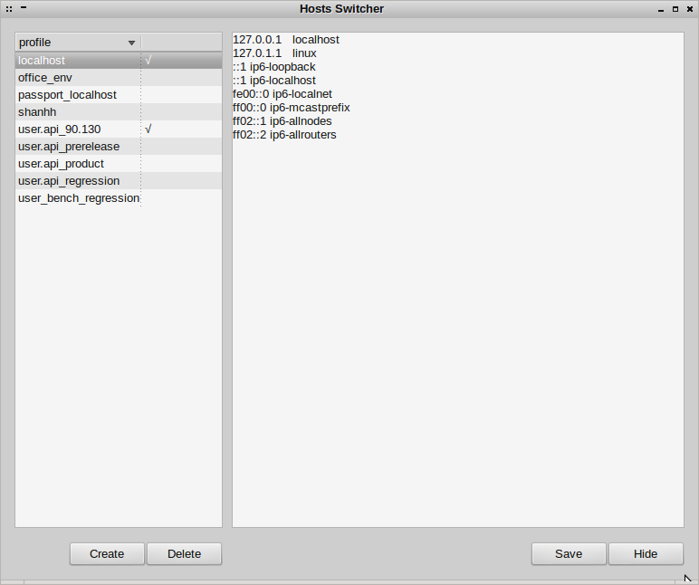

# hosts_switcher

针对 linux 环境下没有好用的切换 hosts 文件的工具. 虽然 [Chrome](https://www.google.com/intl/zh-CN/chrome/browser/) 有 [Hosts Manager](https://chrome.google.com/webstore/detail/hosts-manager/kpfmckjjpabojdhlncnccfhkfhbmnjfi), [HostAdmin](https://chrome.google.com/webstore/detail/hostadmin/oklkidkfohahankieehkeenbillligdn) 等插件; [Firefox](http://www.firefox.com.cn/) 下面也有 [HostAdmin](https://github.com/tg123/chrome-hostadmin), 但这些插件需要重度依赖到浏览器的服务.

修改 `config.py.simple` 为 `config.py` 需要配置两个地方:

> HOSTS_BACKUP_FOLDER 指向本地的一个文件夹, 推荐将该文件夹使用云端备份, 比如 [Dropbox](https://www.dropbox.com/home) 或 [坚果云](https://jianguoyun.com/).

> HOSTS_FILE 当前服务器的hosts地址, 比如 `/etc/hosts`.

请确认当前用户对 HOSTS_FILE 具备足够的读写权限.

运行程序 (支持 python 2.7)

```
python hosts_switcher.py
```

